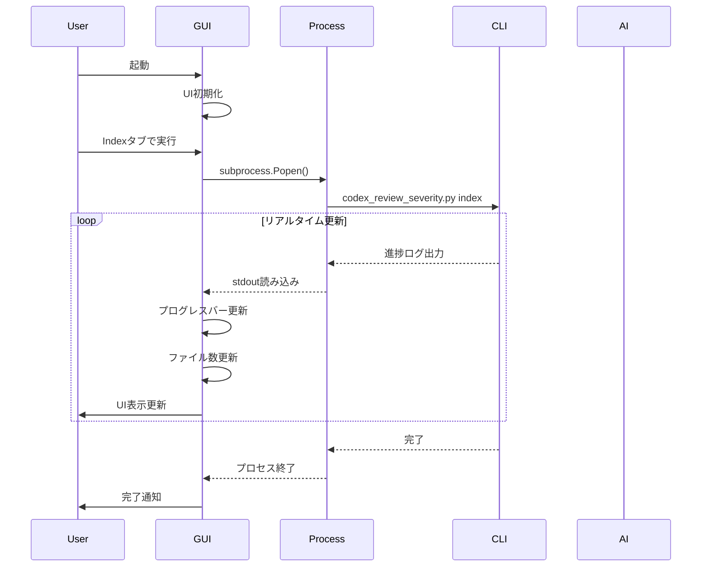
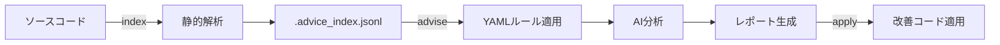

# BugSearch2 アーキテクチャ

*バージョン: v5.0.0 (GUI/CLI デュアルアーキテクチャ)*  
*最終更新: 2025年10月21日*  
*作成者: KEIEI.NET INC.*

## システム概要

BugSearch2 v5.0.0は、GUI Production v1.0.0とCLIの両方を提供する統合コードレビューシステムです。静的解析とAI分析を組み合わせ、9言語・22技術スタックに対応した包括的なコード品質改善を実現します。

## デュアルアーキテクチャ

### 1. GUI Production v1.0.0 アーキテクチャ

```
┌─────────────────────────────────────────────────────────┐
│                  GUI Production v1.0.0                   │
│                    (gui_production.py)                   │
├─────────────────────────────────────────────────────────┤
│                                                          │
│  ┌──────────────────────────────────────────────────┐  │
│  │              CustomTkinter UI Layer              │  │
│  │  ┌──────────┐  ┌──────────┐  ┌──────────┐     │  │
│  │  │   Index  │  │  Advise  │  │  Query   │     │  │
│  │  │    Tab   │  │   Tab    │  │   Tab    │     │  │
│  │  └──────────┘  └──────────┘  └──────────┘     │  │
│  └──────────────────────────────────────────────────┘  │
│                                                          │
│  ┌──────────────────────────────────────────────────┐  │
│  │           Process Management Layer               │  │
│  │  ┌────────────────────────────────────────┐    │  │
│  │  │   subprocess.Popen (unbuffered mode)    │    │  │
│  │  │   - PYTHONUNBUFFERED=1                  │    │  │
│  │  │   - bufsize=1 (line-buffered)           │    │  │
│  │  └────────────────────────────────────────┘    │  │
│  └──────────────────────────────────────────────────┘  │
│                                                          │
│  ┌──────────────────────────────────────────────────┐  │
│  │         Progress Tracking System                 │  │
│  │  ┌──────────────┐  ┌──────────────┐           │  │
│  │  │ File Counter │  │ Speed Calc   │           │  │
│  │  │ 12,500/34,125│  │ 97 files/sec │           │  │
│  │  └──────────────┘  └──────────────┘           │  │
│  │  ┌──────────────────────────────────┐         │  │
│  │  │    ETA Calculator (5分52秒)      │         │  │
│  │  └──────────────────────────────────┘         │  │
│  └──────────────────────────────────────────────────┘  │
│                                                          │
│  ┌──────────────────────────────────────────────────┐  │
│  │            Threading & Queue System              │  │
│  │   threading.Thread ←→ queue.Queue ←→ UI Update  │  │
│  └──────────────────────────────────────────────────┘  │
└─────────────────────────────────────────────────────────┘
```

### 2. CLI アーキテクチャ

```
┌─────────────────────────────────────────────────────────┐
│                    CLI Architecture                      │
├─────────────────────────────────────────────────────────┤
│                                                          │
│  ┌──────────────────────────────────────────────────┐  │
│  │              Main Entry Point                    │  │
│  │           (codex_review_severity.py)             │  │
│  └────────────────┬─────────────────────────────────┘  │
│                   │                                      │
│      ┌────────────┼────────────┐                       │
│      ▼            ▼            ▼                       │
│  ┌────────┐  ┌────────┐  ┌────────┐                  │
│  │ Index  │  │ Advise │  │ Query  │                  │
│  │ Command│  │ Command│  │ Command│                  │
│  └────────┘  └────────┘  └────────┘                  │
│      │            │            │                        │
│      ▼            ▼            ▼                       │
│  ┌──────────────────────────────────────────────────┐  │
│  │              Core Engine Layer                   │  │
│  │  ┌──────────────┐  ┌──────────────┐            │  │
│  │  │ Rule Engine  │  │ AI Analyzer  │            │  │
│  │  │ (64 rules)   │  │(Claude/GPT)  │            │  │
│  │  └──────────────┘  └──────────────┘            │  │
│  │  ┌──────────────┐  ┌──────────────┐            │  │
│  │  │ Tag System   │  │Tech Detector │            │  │
│  │  │ (56 tags)    │  │(22 stacks)   │            │  │
│  │  └──────────────┘  └──────────────┘            │  │
│  └──────────────────────────────────────────────────┘  │
│                                                          │
│  ┌──────────────────────────────────────────────────┐  │
│  │              Data Layer                          │  │
│  │  ┌──────────────┐  ┌──────────────┐            │  │
│  │  │.advice_index │  │   reports/   │            │  │
│  │  │   .jsonl     │  │  *.md files  │            │  │
│  │  └──────────────┘  └──────────────┘            │  │
│  └──────────────────────────────────────────────────┘  │
└─────────────────────────────────────────────────────────┘
```

## コンポーネント詳細

### GUI Components

#### BugSearchProduction クラス
- **責務**: メインGUIアプリケーション管理
- **技術**: CustomTkinter 5.2.2
- **特徴**: 3タブUI、リアルタイム更新

#### Process Management
- **subprocess.Popen**: 外部プロセス制御
- **unbuffered mode**: リアルタイムログ出力
- **環境変数**: PYTHONUNBUFFERED=1

#### Progress Tracking
- **File Counter**: 処理済み/総ファイル数表示
- **Speed Calculator**: files/sec計算（移動平均）
- **ETA Calculator**: 残り時間予測

### CLI Components

#### codex_review_severity.py
- **責務**: メインエントリーポイント
- **コマンド**: index, advise, query
- **機能**: ファイル解析、AI分析、検索

#### Rule Engine (core/rule_engine.py)
- **YAMLルール**: 64個（8DB × 8ルール）
- **カスタムルール**: .bugsearch/rules/
- **優先順位**: カスタム > Config > コア

#### Tech Stack Detector
- **自動検出**: 22技術スタック
- **設定ファイル**: .bugsearch.yml
- **検出方法**: package.json, pom.xml等

#### Tag System
- **言語タグ**: 9種類
- **技術タグ**: 22種類
- **トピックタグ**: 18種類
- **レガシータグ**: 6種類

## データフロー

### GUI実行フロー



### CLI実行フロー



## 並列処理アーキテクチャ

### 並列実行エンジン

```python
ThreadPoolExecutor (max_workers=10)
    ├── Worker Thread 1 → AI分析
    ├── Worker Thread 2 → AI分析
    ├── ...
    └── Worker Thread 10 → AI分析

Queue Management:
    ├── Input Queue (ファイルリスト)
    ├── Processing Queue (実行中タスク)
    └── Output Queue (分析結果)
```

### メモリ管理

```python
Memory Monitor
    ├── 現在使用量監視
    ├── 閾値チェック (2GB)
    ├── 自動GC実行
    └── チェックポイント保存
```

## セキュリティアーキテクチャ

### 防御層

```
Input Validation Layer
    ├── Path Traversal防止
    ├── Symlink検出
    └── Unicode制御文字検出

Process Isolation Layer
    ├── subprocess分離
    ├── 環境変数サニタイズ
    └── タイムアウト制御

File System Protection
    ├── Atomic更新
    ├── ファイルロック
    └── バックアップ作成
```

## スケーラビリティ

### パフォーマンス指標

| プロジェクト規模 | ファイル数 | 処理時間 | メモリ使用 |
|-----------------|-----------|---------|-----------|
| 小規模 | 1,000 | 10秒 | 100MB |
| 中規模 | 10,000 | 2分 | 300MB |
| 大規模 | 30,000+ | 6分 | 500MB |

### 最適化技術

1. **インデックスキャッシュ**
   - .advice_index.jsonl による高速検索
   - TF-IDFベクトル化

2. **差分解析**
   - Git diff統合
   - 変更ファイルのみ再解析

3. **MD5キャッシュ**
   - AI応答の再利用
   - .cache/analysis/ に保存

## デプロイメントアーキテクチャ

### Docker構成

```yaml
services:
  bugsearch-cli:
    image: bugsearch2:cli
    volumes:
      - ./src:/app/src
      - ./reports:/app/reports
    
  bugsearch-gui:
    image: bugsearch2:gui
    environment:
      - DISPLAY=${DISPLAY}
    volumes:
      - /tmp/.X11-unix:/tmp/.X11-unix
```

### CI/CD パイプライン

```
GitHub Actions
    ├── Test Job (pytest実行)
    ├── Lint Job (flake8/black)
    ├── Build Job (Docker image作成)
    └── Deploy Job (リリース作成)
```

## 拡張ポイント

### プラグインアーキテクチャ

```python
Plugin System
    ├── Rule Plugins (カスタムルール追加)
    ├── Language Plugins (新言語サポート)
    ├── AI Plugins (新AIプロバイダー)
    └── Reporter Plugins (レポート形式追加)
```

### API設計（将来）

```
REST API Layer
    ├── /api/v1/index (POST)
    ├── /api/v1/advise (POST)
    ├── /api/v1/query (GET)
    └── /api/v1/report (GET)
```

## システム要件

### 最小要件
- Python 3.11+
- RAM: 4GB
- CPU: 2コア
- Storage: 1GB

### 推奨要件
- Python 3.11.9+
- RAM: 8GB+
- CPU: 4コア+
- Storage: 5GB+
- GPU: 不要

## モニタリング

### メトリクス

```python
Metrics Collection
    ├── 処理ファイル数/秒
    ├── AI API応答時間
    ├── メモリ使用率
    ├── エラー率
    └── キャッシュヒット率
```

### ログ設計

```
Log Levels
    ├── DEBUG: 詳細デバッグ情報
    ├── INFO: 通常動作ログ
    ├── WARNING: 警告メッセージ
    ├── ERROR: エラー情報
    └── CRITICAL: 致命的エラー
```

---

## 📊 参照資料

### Mermaidダイアグラム
- [CLI アーキテクチャ図 v5.0.0](diagrams/ARCHITECTURE_CLI_v5.0.0.mmd) - CLIシステム構成
- [GUI アーキテクチャ図 v1.0.0](diagrams/ARCHITECTURE_GUI_v1.0.0.mmd) - GUIシステム構成

### DrawIOフローチャート
- [GUI Production ワークフロー v1.0.0](flow/GUI_Production_Workflow_v1.0.0.drawio) - GUI操作フロー（3タブUI、リアルタイム進捗）
- [CLI ワークフロー v5.0.0](flow/CLI_Workflow_v5.0.0.drawio) - CLIコマンドフロー（Index/Advise/Query）
- [AI分析パイプライン v5.0.0](flow/AI_Analysis_Pipeline_v5.0.0.drawio) - AI分析処理フロー（深刻度別モデル選択）
- [技術スタック検出 v5.0.0](flow/Tech_Stack_Detection_v5.0.0.drawio) - 自動検出フロー（22技術、56タグ）

---

*作成者: KEIEI.NET INC.*  
*最終更新: 2025年10月21日*  
*バージョン: v5.0.0*

**更新履歴:**
- v5.0.0 (2025年10月21日): GUI/CLIデュアルアーキテクチャ文書化、GUI Production v1.0.0対応、DrawIOフローチャート追加