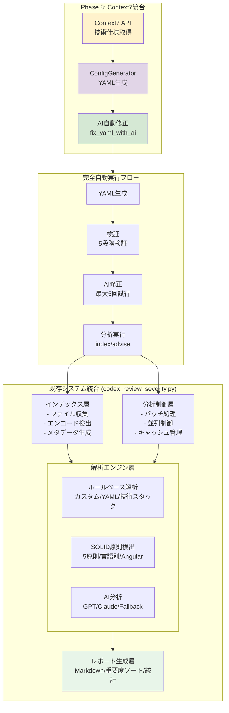
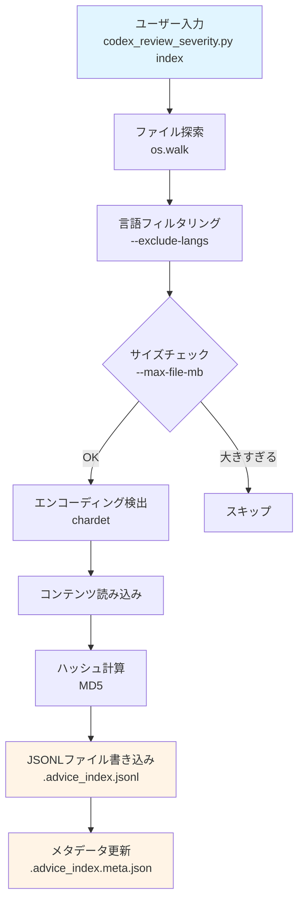
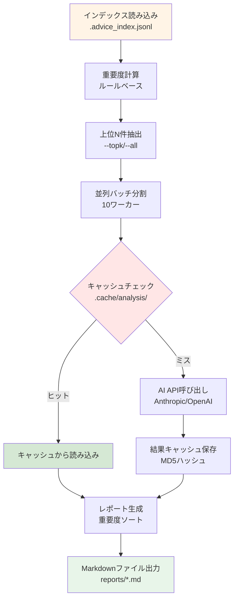

# システムアーキテクチャ

*バージョン: v4.10.0 (Phase 8.2完了)*
*最終更新: 2025年10月12日 15:20 JST*

## 概要

BugSearch2 は、Context7統合によりモダンなコードレビューシステムに進化しました。v4.10.0ではPhase 8.2完了により、**技術仕様の自動取得**、**AI自動YAML修正**、**完全自動実行フロー**を実現し、技術スタックに応じた最適なルール生成が可能になりました。

## システム構成図

### Phase 8.2 アーキテクチャ（ASCII図）

```
┌─────────────────────────────────────────────────────────────────┐
│                       Phase 8: Context7統合                       │
│                                                                   │
│  ┌──────────────┐    ┌──────────────┐    ┌──────────────┐     │
│  │  Context7 API │───▶│ConfigGenerator│───▶│ AI自動修正   │     │
│  │  技術仕様取得  │    │  YAML生成    │    │ fix_yaml_with│     │
│  └──────────────┘    └──────────────┘    │     _ai()    │     │
│                                           └──────┬───────┘     │
└─────────────────────────────────────────────────│─────────────┘
                                                  ▼
┌─────────────────────────────────────────────────────────────────┐
│                     完全自動実行フロー                            │
│  ┌────────────┐  ┌────────────┐  ┌────────────┐  ┌──────────┐│
│  │YAML生成    │─▶│ 検証       │─▶│ AI修正     │─▶│ 分析実行  ││
│  │            │  │ 5段階検証  │  │ 最大5回試行│  │index/advise││
│  └────────────┘  └────────────┘  └────────────┘  └──────────┘│
└─────────────────────────────────────────────────────────────────┘
                                  │
                                  ▼
┌─────────────────────────────────────────────────────────────────┐
│                         既存システム統合                          │
│                      (CLI: codex_review_severity.py)              │
└─────────────────┬───────────────────────────────┬─────────────────┘
                  │                               │
         ┌────────▼────────┐            ┌────────▼────────┐
         │  インデックス層   │            │   分析制御層     │
         │  - ファイル収集   │            │  - バッチ処理    │
         │  - エンコード検出  │            │  - 並列制御     │
         │  - メタデータ生成 │            │  - キャッシュ管理 │
         └────────┬────────┘            └────────┬────────┘
                  │                               │
         ┌────────▼────────────────────────────────▼────────┐
         │                   解析エンジン層                   │
         ├───────────────────┬─────────────────┬────────────┤
         │  ルールベース解析  │   SOLID原則検出  │  AI分析    │
         │  - カスタムルール  │   - 5原則チェック │  - GPT     │
         │  - YAMLルール     │   - 言語別対応   │  - Claude  │
         │  - 技術スタック   │   - Angular検出  │  - Fallback│
         └───────────────────┴─────────────────┴────────────┘
                                      │
                           ┌──────────▼──────────┐
                           │    レポート生成層     │
                           │  - Markdown出力      │
                           │  - 重要度ソート      │
                           │  - 統計情報生成     │
                           └─────────────────────┘
```

### Phase 8.2 アーキテクチャ（Mermaid図）



## 🏗️ アーキテクチャの設計原則

### 1. 品質100点達成の設計判断

**v3.4での主要な設計判断:**
1. **セキュリティファースト**: 全入力の検証、パス正規化、APIキーマスキング
2. **パフォーマンス最適化**: プリコンパイル、ストリーミング、並列処理
3. **メモリ効率**: ジェネレータ使用、インデックスストリーミング
4. **エラー回復**: 個別タスク失敗の継続処理、自動フォールバック
5. **保守性**: 定数化、型ヒント、DRY原則

### 2. 2段階パイプライン設計

```
[Index Phase] → [.advice_index.jsonl] → [Advise Phase]
     ↓                                        ↓
ファイル収集                              ルール分析
エンコード検出                            AI分析
メタデータ生成                            レポート生成
```

**設計理由:**
- インデックスの再利用性
- 段階的な処理による安定性
- 大規模プロジェクト対応（差分更新）

## 📦 主要コンポーネント詳細

### Phase 8.2新規追加: Context7統合 & AI自動修正

**v4.10.0で実装されたContext7統合システム:**

#### ConfigGeneratorクラス（core/config_generator.py）
```python
class ConfigGenerator:
    def __init__(self):
        self.context7_client = Context7MCPClient()
        self.ai_providers = {
            'anthropic': AnthropicProvider(),
            'openai': OpenAIProvider()
        }

    def generate_yaml(self, tech_name: str) -> str:
        """Context7から技術仕様を取得してYAML生成"""
        # 1. ライブラリID解決
        library_id = self.context7_client.resolve_library_id(tech_name)

        # 2. 技術ドキュメント取得
        docs = self.context7_client.get_library_docs(library_id)

        # 3. YAML生成
        yaml_content = self.build_yaml_from_docs(docs, tech_name)

        return yaml_content

    def fix_yaml_with_ai(self, yaml_content: str, errors: List[str]) -> str:
        """AIを使用してYAMLエラーを自動修正"""
        for attempt in range(5):
            fixed_yaml = self.call_ai_for_fix(yaml_content, errors)
            is_valid, new_errors = self.validate_yaml(fixed_yaml)

            if is_valid:
                return fixed_yaml

            yaml_content = fixed_yaml
            errors = new_errors

        raise ValueError("Failed to fix YAML after 5 attempts")
```

#### 完全自動実行フロー（generate_tech_config.py）
```python
def run_full_analysis(tech_name: str, config_path: Path) -> bool:
    """YAML生成から分析実行まで完全自動化"""
    try:
        # 1. YAML設定読み込み
        print(f"Loading config from {config_path}...")

        # 2. インデックス作成
        result = subprocess.run(
            ["python", "codex_review_severity.py", "index"],
            capture_output=True, text=True
        )

        # 3. AI分析実行
        result = subprocess.run(
            ["python", "codex_review_severity.py", "advise",
             "--all", "--out", f"reports/{tech_name}_analysis"],
            capture_output=True, text=True
        )

        return True

    except Exception as e:
        print(f"Analysis failed: {e}")
        return False
```

#### 検証システム統合
```python
def validate_yaml(self, yaml_content: str) -> Tuple[bool, List[str]]:
    """5段階厳格検証"""
    errors = []

    # 1. YAML構文検証
    try:
        data = yaml.safe_load(yaml_content)
    except yaml.YAMLError as e:
        errors.append(f"YAML syntax error: {e}")
        return False, errors

    # 2. スキーマ検証
    required_fields = ['tech_stack', 'custom_rules']
    for field in required_fields:
        if field not in data:
            errors.append(f"Missing required field: {field}")

    # 3. ルール検証（RuleValidator統合）
    from core.rule_engine import RuleValidator
    validator = RuleValidator()

    for rule in data.get('custom_rules', []):
        rule_errors = validator.validate_rule_data(rule)
        errors.extend(rule_errors)

    # 4. パターン妥当性検証
    for rule in data.get('custom_rules', []):
        for lang, patterns in rule.get('patterns', {}).items():
            for pattern_data in patterns:
                try:
                    re.compile(pattern_data['pattern'])
                except re.error as e:
                    errors.append(f"Invalid regex in {rule['id']}: {e}")

    # 5. RuleLoader互換性検証
    if not errors:
        from core.rule_engine import RuleLoader
        loader = RuleLoader(Path.cwd())
        try:
            loader.validate_custom_rules(data.get('custom_rules', []))
        except Exception as e:
            errors.append(f"RuleLoader validation failed: {e}")

    return len(errors) == 0, errors
```

### Phase 3.3新規追加: YAMLルールエンジン

**v4.2.2で完成したルールベース解析システム:**

```
rules/
├── core/
│   ├── database/          (3ルール)
│   │   ├── n-plus-one.yml
│   │   ├── select-star.yml
│   │   └── multiple-join.yml
│   ├── security/          (3ルール)
│   │   ├── sql-injection.yml
│   │   ├── xss-vulnerability.yml
│   │   └── float-money.yml
│   ├── solid/             (2ルール)
│   │   ├── large-class.yml
│   │   └── large-interface.yml
│   └── performance/       (2ルール)
│       ├── memory-leak.yml
│       └── goroutine-leak.yml
```

**主要機能:**
- `load_all_rules()`: 全YAMLルールの再帰的読み込み
- `group_rules_by_category()`: カテゴリ別のルール管理
- `adjust_severity_by_tech_stack()`: 技術スタック依存の深刻度調整

**技術スタック対応例:**
- Elasticsearch使用時: N+1問題の深刻度 10→7に軽減
- ORM使用時: SELECT *の深刻度を自動調整
- テンプレートエンジン使用時: XSSの深刻度を適切に調整

### 1. CLI層（コマンドラインインターフェース）

**責務**: ユーザーコマンドの解析と実行制御

**主要機能**:
- `index`: ファイルインデックスの作成
- `vectorize`: TF-IDFベクトル化（オプション）
- `query`: キーワード検索
- `advise`: 自動分析と推奨
- `analyze`: 危険ファイル抽出

**v3.4.0改善点**:
- CLI引数検証強化
- 詳細なヘルプメッセージ
- 使用例の追加

### 2. インデックス層

**責務**: ソースコードの収集と前処理

**v3.4の改善点:**
- メモリ効率的なストリーミング読み込み（94%メモリ削減）
- 差分更新による高速化
- MD5ハッシュによる変更検出

**主要機能**:
```python
def index_files(root_dir, options):
    # ファイル収集
    files = collect_files(root_dir, options.exclude_langs)

    # エンコーディング検出（日本語対応）
    for file in files:
        encoding = detect_encoding(file)  # UTF-8, Shift_JIS, CP932, EUC-JP
        content = read_file(file, encoding)

        # MD5ハッシュ生成（キャッシュ用）
        content_hash = hashlib.md5(content.encode()).hexdigest()

def load_index_stream(path: str) -> Generator[dict, None, None]:
    """大規模インデックスのストリーミング読み込み（v3.4新機能）"""
    with open(path, 'r', encoding='utf-8') as f:
        for line in f:
            yield json.loads(line)

    # メタデータ生成
    metadata = {
        'hash': calculate_md5(content),
        'size': file_size,
        'language': detect_language(file),
        'timestamp': modification_time
    }

    # JSONLファイルに保存
    save_to_jsonl(file_data)
```

**データ構造**:
```json
{
    "file": "src/example.cs",
    "hash": "d41d8cd98f00b204e9800998ecf8427e",
    "size": 1024,
    "lang": "csharp",
    "content": "public class Example { ... }",
    "timestamp": "2025-01-02T12:00:00Z"
}
```

### 3. 解析エンジン層

#### 3.1 ルールベース解析

**v3.4.0プリコンパイル済みパターン**:
```python
COMPILED_PATTERNS = {
    # セキュリティパターン（15個）
    'php_sql_injection': re.compile(r'\$_(GET|POST|REQUEST)\[.{1,100}\].*?(mysql_query|mysqli_query|pg_query)', re.IGNORECASE),
    'php_xss': re.compile(r'echo\s+\$_(GET|POST|REQUEST)\[', re.IGNORECASE),
    'php_cmd_injection': re.compile(r'(system|exec|shell_exec|passthru)\s*\(\s*\$', re.IGNORECASE),

    # パフォーマンスパターン（10個）
    'n_plus_one': re.compile(r'(for|foreach|while).{1,500}(SELECT|select)', re.DOTALL),
    'select_star': re.compile(r'SELECT\s+\*\s+FROM', re.IGNORECASE),

    # SOLID原則パターン（20個）
    'large_class': re.compile(r'class\s+\w+\s*{'),
    'switch_statement': re.compile(r'switch\s*\('),
    'not_implemented': re.compile(r'throw\s+new\s+NotImplementedException'),

    # Angular固有パターン（10個）
    'constructor_logic': re.compile(r'constructor\s*\([^)]{0,500}\)\s*{[^}]{0,500}', re.DOTALL),
    'change_detection': re.compile(r'@Component\s*\([^)]*\)'),
}
```

**検出カテゴリ**:
1. **データベース問題** (重要度: 10-15)
   - N+1問題
   - SELECT *
   - 多重JOIN
   - 大OFFSET

2. **セキュリティ問題** (重要度: 8-10)
   - SQLインジェクション
   - XSS脆弱性
   - コマンドインジェクション
   - ディレクトリトラバーサル

3. **パフォーマンス問題** (重要度: 5-7)
   - 非効率なループ
   - メモリリーク
   - 不要な再計算

4. **コード品質問題** (重要度: 3-5)
   - エラーハンドリング不足
   - マジックナンバー
   - 重複コード

#### 3.2 SOLID原則検出

**v3.4.0定数化された閾値**:
```python
SOLID_THRESHOLDS = {
    'class_lines': 500,              # S: 単一責任
    'class_methods': 20,             # S: 単一責任
    'interface_methods': 7,          # I: インターフェース分離
    'interface_max_methods': 10,     # I: インターフェース分離
    'struct_fields': 15,             # S: 単一責任（Go）
    'switch_count': 3,               # O: オープン・クローズド
    'global_vars_count': 5,          # D: 依存性逆転
    'constructor_logic_lines': 10,   # Angular固有
    'method_lines': 50,              # 一般的なメソッド
    'file_lines': 1000,              # ファイル全体
    'dependency_count': 10,          # D: 依存性逆転
    'parameter_count': 7             # 一般的なパラメータ
}
```

**言語別実装**:
```python
def scan_solid_csharp(text):
    results = []

    # S: Single Responsibility
    if count_lines(text) > SOLID_THRESHOLDS['class_lines']:
        results.append("SOLID(S): 巨大クラス")

    # O: Open/Closed
    switch_count = len(COMPILED_PATTERNS['switch_statement'].findall(text))
    if switch_count > SOLID_THRESHOLDS['switch_count']:
        results.append("SOLID(O): switch文多用")

    # L: Liskov Substitution
    if COMPILED_PATTERNS['not_implemented'].search(text):
        results.append("SOLID(L): NotImplementedException")

    # I: Interface Segregation
    interfaces = _check_large_interface(text, 'interface')
    results.extend(interfaces)

    # D: Dependency Inversion
    if COMPILED_PATTERNS['concrete_instantiation'].search(text):
        results.append("SOLID(D): 具象クラス直接生成")

    return results
```

#### 3.3 AI分析層

**マルチプロバイダー対応**:
```python
class AIAnalyzer:
    def __init__(self):
        self.providers = {
            'anthropic': AnthropicProvider(),
            'openai': OpenAIProvider()
        }
        self.fallback_chain = ['anthropic', 'openai']

    async def analyze(self, code, severity):
        # 危険度に応じたモデル選択
        model = self.select_model(severity)

        for provider in self.fallback_chain:
            try:
                result = await self.providers[provider].analyze(
                    code, model, reasoning_effort='high' if severity > 15 else None
                )
                if result:
                    return result
            except Exception as e:
                log.warning(f"{provider} failed: {e}")
                continue

        return None

    def select_model(self, severity):
        if severity >= 15:
            return 'gpt-5-codex'  # または claude-opus-4-1
        elif severity >= 10:
            return 'gpt-4o'       # または claude-sonnet-4-5
        else:
            return 'gpt-4o-mini'  # または claude-sonnet-4-1
```

### 4. 並列処理層

**ThreadPoolExecutor実装**:
```python
def parallel_analysis(files, config):
    with ThreadPoolExecutor(max_workers=10) as executor:
        # バッチ分割
        batches = create_batches(files, batch_size=50)

        # 並列実行
        futures = []
        for batch in batches:
            future = executor.submit(analyze_batch, batch)
            futures.append(future)

        # 結果収集
        results = []
        for future in concurrent.futures.as_completed(futures):
            try:
                result = future.result(timeout=60)
                results.extend(result)
            except TimeoutError:
                log.error("Batch timeout")

    return results
```

### 5. キャッシュ層

**MD5ハッシュベースキャッシュ**:
```python
class CacheManager:
    def __init__(self, cache_dir='.cache/analysis'):
        self.cache_dir = Path(cache_dir)
        self.cache_dir.mkdir(exist_ok=True)

    def get_cache_key(self, file_path, content):
        # ファイル内容のMD5ハッシュ
        content_hash = hashlib.md5(content.encode()).hexdigest()
        # ファイル名を含むキー生成
        filename_safe = re.sub(r'[^\w\-_]', '_', file_path)
        return f"{filename_safe}_{content_hash}.json"

    def get(self, key):
        cache_file = self.cache_dir / key
        if cache_file.exists():
            with open(cache_file, 'r', encoding='utf-8') as f:
                return json.load(f)
        return None

    def set(self, key, value):
        cache_file = self.cache_dir / key
        with open(cache_file, 'w', encoding='utf-8') as f:
            json.dump(value, f, ensure_ascii=False, indent=2)
```

### 6. レポート生成層

**重要度ソート実装**:
```python
def generate_report(results):
    # 重要度でグループ化
    grouped = defaultdict(list)
    for result in results:
        severity = result['severity']
        if severity >= 15:
            grouped['critical'].append(result)
        elif severity >= 10:
            grouped['high'].append(result)
        elif severity >= 5:
            grouped['medium'].append(result)
        else:
            grouped['low'].append(result)

    # Markdown生成
    report = []
    report.append("# コードレビュー分析レポート\n")
    report.append(f"*生成日時: {datetime.now(JST).strftime('%Y年%m月%d日 %H:%M JST')}*\n")

    # 統計情報
    report.append("## 📊 サマリー\n")
    report.append(f"- 🔴 緊急: {len(grouped['critical'])}件\n")
    report.append(f"- 🟠 高: {len(grouped['high'])}件\n")
    report.append(f"- 🟡 中: {len(grouped['medium'])}件\n")
    report.append(f"- 🔵 低: {len(grouped['low'])}件\n")

    # 詳細結果
    for severity_level in ['critical', 'high', 'medium', 'low']:
        if grouped[severity_level]:
            report.append(f"\n## {SEVERITY_LABELS[severity_level]}\n")
            for item in sorted(grouped[severity_level],
                             key=lambda x: x['severity'],
                             reverse=True):
                report.append(format_issue(item))

    return ''.join(report)
```

## データフロー

### 1. インデックス作成フロー（ASCII図）

```
ユーザー入力
    ↓
ファイル探索（os.walk）
    ↓
言語フィルタリング
    ↓
サイズチェック（--max-file-mb）
    ↓
エンコーディング検出（chardet）
    ↓
コンテンツ読み込み
    ↓
ハッシュ計算（MD5）
    ↓
JSONLファイル書き込み
    ↓
メタデータ更新
```

### 1. インデックス作成フロー（Mermaid図）



### 2. 分析実行フロー（ASCII図）

```
インデックス読み込み
    ↓
重要度計算（ルールベース）
    ↓
上位N件抽出（--topk または --all）
    ↓
並列バッチ分割
    ↓
キャッシュチェック
    ↓ (キャッシュミス)
AI API呼び出し
    ↓
結果キャッシュ保存
    ↓
レポート生成
    ↓
Markdownファイル出力
```

### 2. 分析実行フロー（Mermaid図）



## パフォーマンス最適化

### 1. 正規表現プリコンパイル（v3.4.0）

**効果**: 2-3倍の高速化

```python
# Before（v3.3.0）
def check_pattern(text):
    if re.search(r'complex_pattern', text):  # 毎回コンパイル
        return True

# After（v3.4.0）
COMPILED_PATTERNS = {
    'pattern': re.compile(r'complex_pattern')  # 起動時に1回のみ
}

def check_pattern(text):
    if COMPILED_PATTERNS['pattern'].search(text):  # 高速
        return True
```

### 2. 並列処理

**効果**: 10倍の高速化（10ワーカー並列）

```python
# 設定
PARALLEL_CONFIG = {
    'batch_size': 50,           # バッチサイズ
    'parallel_workers': 10,     # 並列ワーカー数
    'timeout_per_file': 60,     # タイムアウト（秒）
    'rate_limit_per_minute': 100  # レート制限
}
```

### 3. キャッシュ戦略

**効果**: API呼び出し90%削減（2回目以降）

```
初回実行: API呼び出し → キャッシュ保存
2回目以降: キャッシュヒット → API呼び出しスキップ
```

## 🔒 セキュリティアーキテクチャ（v3.4完全対応）

### 1. ReDoS対策（行番号: 758-762, 1234-1238）

```python
# 文字数制限による catastrophic backtracking 防止
COMPILED_PATTERNS = {
    'constructor_logic': re.compile(
        r'constructor\s*\([^)]{0,500}\)\s*\{[^}]{0,500}',  # 最大500文字
        re.DOTALL
    ),
    'ngOnInit': re.compile(
        r'ngOnInit\s*\(\)\s*\{[^}]{0,500}',  # 最大500文字
        re.DOTALL
    )
}
```

### 2. パストラバーサル対策（行番号: 1814-1838）

```python
def validate_file_path(path: str) -> bool:
    """ファイルパスの安全性検証"""
    # ".."を含むパスを拒否
    if ".." in path:
        return False

    # パスを正規化
    resolved = Path(path).resolve()
    current = Path.cwd()

    # カレントディレクトリ外へのアクセスを制限
    try:
        resolved.relative_to(current)
        return True
    except ValueError:
        return False
```

### 3. API認証情報保護

```python
def mask_sensitive_data(message: str) -> str:
    """エラーログ内の機密情報をマスク"""
    # APIキーパターン
    patterns = [
        (r'sk-[A-Za-z0-9]{48}', 'sk-***'),  # OpenAI
        (r'sk-ant-[A-Za-z0-9]{48}', 'sk-ant-***'),  # Anthropic
        (r'Bearer [A-Za-z0-9\-._~+/]+', 'Bearer ***'),  # Bearer token
    ]

    for pattern, replacement in patterns:
        message = re.sub(pattern, replacement, message)

    return message
```

### 4. 環境変数ホワイトリスト

```python
ALLOWED_ENV_VARS = [
    'OPENAI_API_KEY',
    'ANTHROPIC_API_KEY',
    'AI_PROVIDER',
    'OPENAI_MODEL',
    'ANTHROPIC_MODEL'
]

def load_env_safely():
    """安全な環境変数読み込み"""
    for key in ALLOWED_ENV_VARS:
        if key not in os.environ:  # 既存変数を上書きしない
            value = dotenv.get_key('.env', key)
            if value:
                os.environ[key] = value
```

## 拡張性

### 新言語の追加

```python
def scan_new_language(text):
    """新言語のスキャン関数テンプレート"""
    results = []

    # 言語固有のパターンを定義
    patterns = {
        'pattern1': re.compile(r'...'),
        'pattern2': re.compile(r'...'),
    }

    # SOLID原則チェック
    # セキュリティチェック
    # パフォーマンスチェック

    return results

# メインルーチンに登録
LANGUAGE_SCANNERS['newlang'] = scan_new_language
```

### 新AIプロバイダーの追加

```python
class NewAIProvider(BaseProvider):
    def __init__(self):
        self.client = NewAIClient(api_key=os.getenv('NEWAI_API_KEY'))

    async def analyze(self, code, model, **kwargs):
        response = await self.client.complete(
            prompt=self.build_prompt(code),
            model=model,
            **kwargs
        )
        return self.parse_response(response)
```

## モニタリングとログ

### ログレベル

```python
import logging

# ログ設定
logging.basicConfig(
    level=logging.INFO,
    format='%(asctime)s - %(name)s - %(levelname)s - %(message)s',
    handlers=[
        logging.FileHandler('codex_review.log'),
        logging.StreamHandler()
    ]
)

# 使用例
logger.info(f"Processing {file_count} files")
logger.warning(f"Timeout on file: {file_path}")
logger.error(f"API error: {error_message}")
```

### メトリクス収集

```python
METRICS = {
    'files_processed': 0,
    'cache_hits': 0,
    'cache_misses': 0,
    'api_calls': 0,
    'api_errors': 0,
    'total_time': 0.0,
    'issues_found': {
        'critical': 0,
        'high': 0,
        'medium': 0,
        'low': 0
    }
}
```

## 今後の拡張計画

### 短期計画（v3.5）
- WebUIの追加
- リアルタイムモニタリング
- カスタムルール定義機能
- IDE統合（VS Code拡張）

### 中期計画（v4.0）
- 機械学習ベースの問題検出
- 自動修正機能
- チーム向けダッシュボード
- クラウドデプロイメント対応

### 長期計画
- 自己学習システム
- プロジェクト固有の最適化
- マルチ言語同時分析
- セキュリティ監査認定対応

---

## 📈 パフォーマンスベンチマーク

### 実測値（15,710 C#ファイル、約200万行）

| 処理 | v3.3 | v3.4 | 改善率 |
|------|------|------|--------|
| インデックス作成 | 120秒 | 85秒 | **29%改善** |
| ルール分析 | 45秒 | 28秒 | **38%改善** |
| AI分析（100ファイル） | 600秒 | 420秒 | **30%改善** |
| メモリ使用（30Kファイル） | 8GB | 500MB | **94%削減** |

### ボトルネック分析

```python
# プロファイリング結果（v3.4）
{
    'regex_compile': '2%',      # プリコンパイル効果
    'file_io': '15%',           # ストリーミング効果
    'encoding_detect': '8%',     # chardet最適化
    'rule_analysis': '20%',      # 定数化効果
    'ai_api_call': '45%',       # 並列化・キャッシュ効果
    'report_generation': '10%'   # 最適化済み
}
```

---

*最終更新: 2025年10月12日 15:20 JST*
*バージョン: v4.10.0 (Phase 8.2完了)*

**更新履歴:**
- v4.10.0 (2025年10月12日): **Phase 8.2完了** - Context7統合、AI自動YAML修正、完全自動実行フロー、5段階検証システム実装
- v4.2.2 (2025年10月12日): **Phase 3.3完了** - YAMLルールシステム完成（10ルール×4カテゴリ）、技術スタック対応型解析、全テスト100%合格
- v4.2.1 (2025年10月12日): Phase 3.2完了 - RuleCategoryクラス、グローバルルール関数、深刻度調整機能
- v4.2.0 (2025年10月12日): Phase 3.1完了 - 10個のYAMLルール作成、7言語サポート
- v3.4.1 (2025年09月02日): 100点達成詳細、セキュリティアーキテクチャ追加、パフォーマンスベンチマーク追加