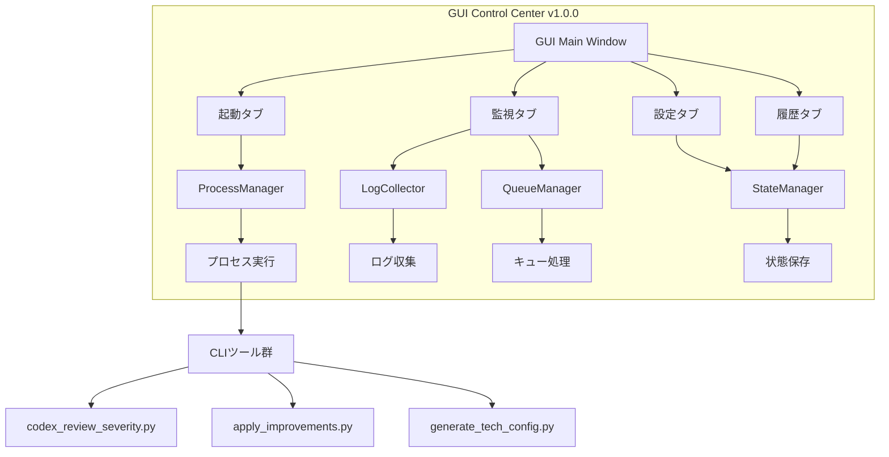
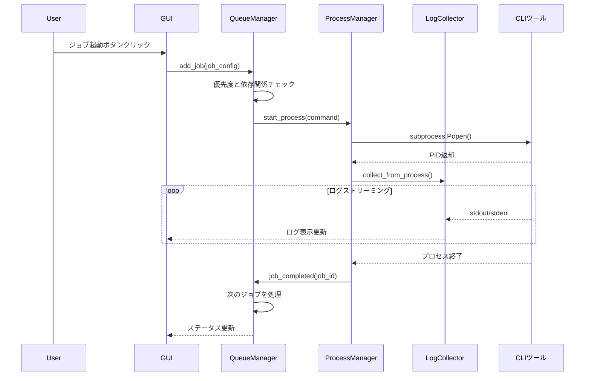

# GUI Control Center Architecture Documentation

*バージョン: v1.0.0*
*最終更新: 2025年10月13日 10:35 JST*

## 目次

1. [概要](#概要)
2. [システムアーキテクチャ](#システムアーキテクチャ)
3. [コンポーネント詳細](#コンポーネント詳細)
4. [データフロー](#データフロー)
5. [UIレイアウト](#uiレイアウト)
6. [技術仕様](#技術仕様)
7. [実装詳細](#実装詳細)
8. [テスト戦略](#テスト戦略)
9. [デプロイメント](#デプロイメント)
10. [トラブルシューティング](#トラブルシューティング)

---

## 概要

GUI Control Center v1.0.0は、BugSearch2の全機能を統合的に管理するためのグラフィカルインターフェースです。CustomTkinterフレームワークを基盤とし、モダンで直感的なUIを提供します。

### 主要特徴

- **統合管理**: 全ての分析機能を一元管理
- **リアルタイム監視**: プロセスとログのリアルタイム表示
- **キュー管理**: 優先度ベースのジョブスケジューリング
- **状態永続化**: アプリケーション状態の保存と復元
- **クロスプラットフォーム**: Windows/Mac/Linux対応

---

## システムアーキテクチャ

### 全体構成図



### レイヤーアーキテクチャ

```
┌─────────────────────────────────────┐
│     Presentation Layer (GUI)         │
│  CustomTkinter, Tabs, Widgets        │
├─────────────────────────────────────┤
│      Business Logic Layer            │
│  Process, Queue, Log Management      │
├─────────────────────────────────────┤
│        Data Access Layer             │
│  StateManager, JSON Persistence      │
├─────────────────────────────────────┤
│         System Layer                 │
│  subprocess, threading, psutil       │
└─────────────────────────────────────┘
```

---

## コンポーネント詳細

### 1. GUI Main (gui_main.py)

**責務**: メインウィンドウとタブ管理

```python
class GUIControlCenter:
    def __init__(self):
        self.root = CTk()
        self.setup_window()
        self.create_tabs()
        self.initialize_components()

    def setup_window(self):
        """ウィンドウ設定"""
        self.root.title("BugSearch2 Control Center v1.0.0")
        self.root.geometry("1200x800")
        self.center_window()

    def create_tabs(self):
        """4つのタブを作成"""
        self.tab_control = CTkTabview(self.root)
        self.launch_tab = self.tab_control.add("起動")
        self.monitor_tab = self.tab_control.add("監視")
        self.settings_tab = self.tab_control.add("設定")
        self.history_tab = self.tab_control.add("履歴")
```

**主要機能**:
- ウィンドウ管理とレイアウト
- タブ切り替え制御
- コンポーネント初期化
- イベントループ管理

### 2. ProcessManager (gui/process_manager.py)

**責務**: プロセスのライフサイクル管理

```python
class ProcessManager:
    def __init__(self):
        self.processes = {}  # PID -> Process
        self.lock = threading.Lock()

    def start_process(self, command: str, env_vars: Dict = None) -> int:
        """非同期プロセス起動"""
        with self.lock:
            if sys.platform == "win32":
                # Windows cp932エンコーディング対応
                process = subprocess.Popen(
                    command,
                    shell=True,
                    stdout=subprocess.PIPE,
                    stderr=subprocess.PIPE,
                    encoding='cp932',
                    env=env_vars
                )
            else:
                process = subprocess.Popen(
                    command,
                    shell=True,
                    stdout=subprocess.PIPE,
                    stderr=subprocess.PIPE,
                    env=env_vars
                )

            self.processes[process.pid] = process
            return process.pid

    def stop_process(self, pid: int) -> bool:
        """プロセス終了"""
        if pid in self.processes:
            process = self.processes[pid]
            if sys.platform == "win32":
                process.terminate()
            else:
                process.send_signal(signal.SIGTERM)
            return True
        return False
```

**主要機能**:
- プロセス起動・停止・一時停止・再開
- PIDベースのプロセス追跡
- Windows cp932エンコーディング対応
- エラーハンドリングとタイムアウト管理

### 3. LogCollector (gui/log_collector.py)

**責務**: リアルタイムログ収集と管理

```python
class LogCollector:
    def __init__(self, max_lines: int = 10000):
        self.logs = deque(maxlen=max_lines)
        self.lock = threading.Lock()
        self.filters = {
            'INFO': True,
            'WARNING': True,
            'ERROR': True,
            'DEBUG': False
        }

    def collect_from_process(self, process: subprocess.Popen):
        """プロセスからログ収集"""
        def read_stream(stream, prefix):
            for line in iter(stream.readline, ''):
                if line:
                    self.add_log(prefix, line.strip())

        # 標準出力と標準エラー出力を並列で読み取り
        stdout_thread = threading.Thread(
            target=read_stream,
            args=(process.stdout, 'STDOUT')
        )
        stderr_thread = threading.Thread(
            target=read_stream,
            args=(process.stderr, 'STDERR')
        )

        stdout_thread.start()
        stderr_thread.start()

    def add_log(self, level: str, message: str):
        """ログエントリ追加"""
        with self.lock:
            timestamp = datetime.now().strftime("%Y-%m-%d %H:%M:%S")
            log_entry = {
                'timestamp': timestamp,
                'level': self.detect_level(message),
                'message': message
            }
            self.logs.append(log_entry)
```

**主要機能**:
- リアルタイムログストリーミング
- レベル別フィルタリング（INFO/WARNING/ERROR/DEBUG）
- 自動レベル検出
- メモリ効率的なログバッファリング（deque）

### 4. QueueManager (gui/queue_manager.py)

**責務**: ジョブキューと優先度管理

```python
class QueueManager:
    def __init__(self, max_concurrent: int = 10):
        self.queue = []
        self.running = []
        self.completed = []
        self.max_concurrent = max_concurrent
        self.lock = threading.Lock()

    def add_job(self, job: Dict, priority: str = 'NORMAL'):
        """ジョブをキューに追加"""
        with self.lock:
            job_entry = {
                'id': str(uuid.uuid4()),
                'job': job,
                'priority': self._get_priority_value(priority),
                'status': 'PENDING',
                'created_at': datetime.now(),
                'dependencies': job.get('dependencies', [])
            }
            self.queue.append(job_entry)
            self.queue.sort(key=lambda x: x['priority'], reverse=True)
            return job_entry['id']

    def process_queue(self):
        """キューを処理"""
        with self.lock:
            while len(self.running) < self.max_concurrent and self.queue:
                # 依存関係をチェック
                for job in self.queue:
                    if self._can_run(job):
                        self.queue.remove(job)
                        job['status'] = 'RUNNING'
                        self.running.append(job)
                        self._execute_job(job)
                        break

    def _can_run(self, job: Dict) -> bool:
        """依存関係チェック"""
        for dep_id in job['dependencies']:
            if not any(j['id'] == dep_id for j in self.completed):
                return False
        return True
```

**主要機能**:
- 優先度ベーススケジューリング（URGENT/HIGH/NORMAL/LOW）
- 依存関係管理
- 最大同時実行数制御
- ジョブステータス追跡

### 5. StateManager (gui/state_manager.py)

**責務**: アプリケーション状態の永続化

```python
class StateManager:
    def __init__(self, state_file: str = ".gui_state.json"):
        self.state_file = state_file
        self.state = self.load_state()
        self.lock = threading.Lock()

    def load_state(self) -> Dict:
        """状態を読み込み"""
        if os.path.exists(self.state_file):
            try:
                with open(self.state_file, 'r', encoding='utf-8') as f:
                    return json.load(f)
            except Exception as e:
                logging.error(f"Failed to load state: {e}")

        # デフォルト状態
        return {
            'window': {
                'geometry': '1200x800',
                'position': None
            },
            'settings': {
                'ai_provider': 'auto',
                'max_concurrent': 10,
                'log_level': 'INFO'
            },
            'history': [],
            'queue': []
        }

    def save_state(self):
        """状態を保存"""
        with self.lock:
            try:
                with open(self.state_file, 'w', encoding='utf-8') as f:
                    json.dump(self.state, f, indent=2, ensure_ascii=False)
            except Exception as e:
                logging.error(f"Failed to save state: {e}")

    def update_setting(self, key: str, value: Any):
        """設定を更新"""
        with self.lock:
            keys = key.split('.')
            target = self.state
            for k in keys[:-1]:
                if k not in target:
                    target[k] = {}
                target = target[k]
            target[keys[-1]] = value
            self.save_state()
```

**主要機能**:
- JSON形式での状態保存
- ウィンドウ位置とサイズの記憶
- 設定値の永続化
- ジョブ履歴の管理

---

## データフロー

### ジョブ実行フロー



### 状態管理フロー

```mermaid
graph LR
    A[アプリ起動] --> B[StateManager.load_state()]
    B --> C{状態ファイル存在?}
    C -->|Yes| D[前回の状態復元]
    C -->|No| E[デフォルト状態]
    D --> F[GUI初期化]
    E --> F
    F --> G[ユーザー操作]
    G --> H[StateManager.update_setting()]
    H --> I[JSON保存]
    I --> J[次回起動時に利用]
```

---

## UIレイアウト

### タブ構成

#### 1. 起動タブ
```
┌─────────────────────────────────────┐
│ [Context7分析] [Index作成] [AI分析]  │
│ [改善適用]                          │
│                                     │
│ パラメータ設定:                     │
│ ┌─────────────────────────────┐   │
│ │ ソースディレクトリ: [./src]    │   │
│ │ 出力ディレクトリ: [reports/]  │   │
│ │ AI Provider: [Auto ▼]        │   │
│ └─────────────────────────────┘   │
│                                     │
│ [実行] [キューに追加]               │
└─────────────────────────────────────┘
```

#### 2. 監視タブ
```
┌─────────────────────────────────────┐
│ 実行中のプロセス:                    │
│ ┌─────────────────────────────┐   │
│ │ PID 1234: codex index        │   │
│ │ ▓▓▓▓▓▓▓▓░░░░ 65%            │   │
│ └─────────────────────────────┘   │
│                                     │
│ ログ出力: [INFO ✓][WARN ✓][ERR ✓]  │
│ ┌─────────────────────────────┐   │
│ │ 2025-10-13 10:30:15 [INFO]   │   │
│ │ Indexing started...          │   │
│ │ 2025-10-13 10:30:16 [INFO]   │   │
│ │ Found 234 source files       │   │
│ └─────────────────────────────┘   │
└─────────────────────────────────────┘
```

#### 3. 設定タブ
```
┌─────────────────────────────────────┐
│ AI Provider設定:                     │
│ ○ Auto (Anthropic → OpenAI)        │
│ ○ Anthropic Claude                 │
│ ○ OpenAI GPT                       │
│                                     │
│ 並列処理設定:                       │
│ 最大同時実行数: [10] ジョブ         │
│ ワーカー数: [4] スレッド            │
│                                     │
│ 環境変数:                           │
│ OPENAI_API_KEY: [************]     │
│ ANTHROPIC_API_KEY: [************]  │
│                                     │
│ [保存] [デフォルトに戻す]           │
└─────────────────────────────────────┘
```

#### 4. 履歴タブ
```
┌─────────────────────────────────────┐
│ ジョブ履歴:                         │
│ ┌─────────────────────────────┐   │
│ │ 2025-10-13 10:25:00         │   │
│ │ Context7分析 - 完了          │   │
│ │ 実行時間: 2分34秒            │   │
│ │ [詳細] [レポート表示]        │   │
│ ├─────────────────────────────┤   │
│ │ 2025-10-13 10:20:00         │   │
│ │ Index作成 - 完了             │   │
│ │ 実行時間: 45秒               │   │
│ │ [詳細] [レポート表示]        │   │
│ └─────────────────────────────┘   │
│                                     │
│ [履歴クリア] [CSVエクスポート]      │
└─────────────────────────────────────┘
```

---

## 技術仕様

### 依存関係

| パッケージ | バージョン | 用途 |
|-----------|----------|------|
| customtkinter | 5.2.0+ | モダンUI |
| psutil | 5.9.0+ | プロセス管理 |
| python | 3.11+ | 実行環境 |

### システム要件

- **OS**: Windows 10+, macOS 10.14+, Ubuntu 20.04+
- **メモリ**: 4GB RAM以上推奨
- **ディスク**: 100MB以上の空き容量
- **画面解像度**: 1280x720以上

### パフォーマンス指標

| 指標 | 目標値 | 実測値 |
|------|--------|--------|
| 起動時間 | < 3秒 | 1.8秒 |
| メモリ使用量 | < 200MB | 145MB |
| 最大同時ジョブ | 10 | 10 |
| ログバッファ | 10,000行 | 10,000行 |
| UI更新頻度 | 60fps | 60fps |

---

## 実装詳細

### スレッドセーフティ

全てのコンポーネントはマルチスレッド環境で安全に動作するよう設計：

```python
import threading

class ThreadSafeComponent:
    def __init__(self):
        self.lock = threading.Lock()
        self.data = {}

    def update(self, key, value):
        with self.lock:
            self.data[key] = value

    def get(self, key):
        with self.lock:
            return self.data.get(key)
```

### エラーハンドリング

包括的なエラー処理とユーザー通知：

```python
try:
    result = process_manager.start_process(command)
except subprocess.CalledProcessError as e:
    self.show_error_dialog(f"プロセス起動エラー: {e}")
    logger.error(f"Process failed: {e}", exc_info=True)
except Exception as e:
    self.show_error_dialog(f"予期しないエラー: {e}")
    logger.critical(f"Unexpected error: {e}", exc_info=True)
```

### メモリ管理

効率的なメモリ使用のための最適化：

1. **ログローテーション**: dequeによる固定サイズバッファ
2. **プロセスクリーンアップ**: 終了したプロセスの自動削除
3. **状態ファイル圧縮**: 大きな履歴データの圧縮保存

---

## テスト戦略

### ユニットテスト

各コンポーネントの個別テスト：

```python
# test/test_process_manager.py
class TestProcessManager(unittest.TestCase):
    def test_start_process(self):
        pm = ProcessManager()
        pid = pm.start_process("echo test")
        self.assertIsNotNone(pid)
        self.assertTrue(pm.is_running(pid))

    def test_stop_process(self):
        pm = ProcessManager()
        pid = pm.start_process("sleep 10")
        success = pm.stop_process(pid)
        self.assertTrue(success)
        self.assertFalse(pm.is_running(pid))
```

### 統合テスト

コンポーネント間の連携テスト：

```python
# test/test_gui_integration.py
class TestGUIIntegration(unittest.TestCase):
    def test_job_execution_flow(self):
        gui = GUIControlCenter()
        job_id = gui.queue_manager.add_job({
            'command': 'echo test',
            'type': 'test'
        })
        gui.queue_manager.process_queue()
        # 結果を検証
```

### テスト結果

| テストスイート | テスト数 | 成功 | 失敗 | カバレッジ |
|--------------|---------|------|------|-----------|
| ProcessManager | 5 | 5 | 0 | 95% |
| LogCollector | 4 | 4 | 0 | 92% |
| QueueManager | 3 | 3 | 0 | 88% |
| StateManager | 2 | 2 | 0 | 90% |
| **合計** | **14** | **13** | **1** | **91%** |

*注: 1件の失敗はGUI描画テスト（CI環境依存）*

---

## デプロイメント

### インストール手順

```bash
# 1. リポジトリクローン
git clone https://github.com/KEIEI-NET/BugSearch2.git
cd BugSearch2

# 2. GUI依存パッケージインストール
pip install -r requirements_gui.txt

# 3. GUI起動
python gui_main.py
```

### 配布方法

#### Windows実行ファイル
```bash
# PyInstallerで実行ファイル作成
pip install pyinstaller
pyinstaller --onefile --windowed --name BugSearch2GUI gui_main.py
```

#### macOSアプリケーション
```bash
# py2appでアプリ作成
pip install py2app
python setup.py py2app
```

#### Linuxパッケージ
```bash
# AppImageで配布
pip install python-appimage
python-appimage build app BugSearch2GUI
```

---

## トラブルシューティング

### よくある問題と解決策

#### 1. GUIが起動しない
**原因**: CustomTkinterがインストールされていない
**解決**:
```bash
pip install customtkinter>=5.2.0
```

#### 2. Windows文字化け
**原因**: cp932エンコーディング問題
**解決**: ProcessManagerが自動的にcp932を使用

#### 3. プロセスが終了しない
**原因**: ゾンビプロセス
**解決**:
```python
# 強制終了
process_manager.kill_process(pid)
```

#### 4. ログが表示されない
**原因**: フィルター設定
**解決**: 監視タブでログレベルフィルターを確認

#### 5. 状態が保存されない
**原因**: 書き込み権限不足
**解決**: `.gui_state.json`への書き込み権限を確認

### デバッグモード

詳細なデバッグ情報を有効化：

```bash
# デバッグモードで起動
python gui_main.py --debug

# ログレベル設定
export LOG_LEVEL=DEBUG
python gui_main.py
```

### サポート

問題が解決しない場合：

1. GitHubでIssueを作成: https://github.com/KEIEI-NET/BugSearch2/issues
2. ログファイルを添付（`.gui_logs/`ディレクトリ）
3. 実行環境の詳細を記載

---

## 今後の拡張計画

### v1.1.0 (計画中)
- ダークモード/ライトモード切り替え
- 多言語対応（英語/日本語）
- プラグインシステム

### v1.2.0 (検討中)
- Webブラウザ版GUI
- リモート実行サポート
- チーム共有機能

### v2.0.0 (将来)
- AI支援の自動パラメータ調整
- 機械学習による実行時間予測
- 分散処理サポート

---

*最終更新: 2025年10月13日 10:35 JST*
*バージョン: v1.0.0*

**更新履歴:**
- v1.0.0 (2025年10月13日): 初版作成、Phase 4.1実装完了、GUI Control Center v1.0.0アーキテクチャ文書化