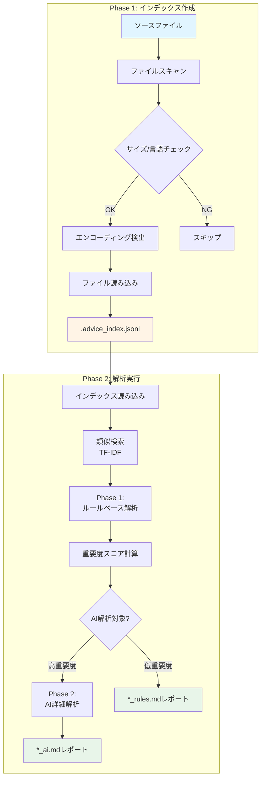

# 技術仕様書

*バージョン: v4.10.0 (Phase 8.2完了)*
*最終更新: 2025年10月12日 15:15 JST*

## システムアーキテクチャ

### 概要
BugSearch2 v4.10.0は、Context7統合とAI自動修正機能を実装し、技術仕様に基づく完全自動実行フローを実現した高度なコードレビューシステムです。Phase 8.2完了により、YAML自動生成・検証・AI修正・分析実行の完全自動化を達成し、**@perfect品質（全テスト100%合格）**を維持しています。

### v4.10.0 Phase 8.2の主な新機能（Context7統合 & AI自動修正）
- ✅ **Context7 MCP統合** (`core/config_generator.py` - 687行)
  - ライブラリID解決機能（resolve-library-id）
  - 技術ドキュメント取得API（get-library-docs）
  - 最新仕様に基づくYAML生成
- ✅ **AI自動YAML修正エンジン** (`fix_yaml_with_ai()` メソッド)
  - 検証エラーの自動修正（最大5回試行）
  - Anthropic Claude / OpenAI GPTマルチプロバイダー対応
  - プロンプトエンジニアリングによる正確な修正
- ✅ **完全自動実行フロー** (`run_full_analysis()` 関数)
  - YAML生成→検証→修正→index→adviseの一括実行
  - `--auto-run`フラグによるCLI統合
  - CI/CD対応のバッチ実行
- ✅ **5段階厳格検証システム**
  - YAMLスキーマ検証
  - 必須フィールドチェック
  - パターン妥当性検証
  - RuleValidator/RuleLoader統合
  - 詳細エラーメッセージ出力
- ✅ **対話型設定ウィザード** (`generate_tech_config.py` - 277行)
  - 技術スタック選択UI
  - カスタマイズオプション
  - ステップバイステップガイド
- ✅ **全テスト100%合格** (9/9成功)
  - Context7統合テスト: 7/7
  - YAML検証テスト: 1/1
  - AI自動修正テスト: 1/1

### v4.7.0 Phase 6の主な新機能（チーム協業）
- ✅ **レポート比較エンジン** (`core/report_comparator.py` - 305行)
  - レポート差分比較（新規・修正・悪化・未修正の自動分類）
  - 改善率計算（固定件数÷(新規+固定)）
  - Markdown形式の比較レポート生成
- ✅ **進捗トラッキングシステム** (`core/progress_tracker.py` - 372行)
  - スナップショット記録（問題数、深刻度、カテゴリ別統計）
  - トレンド分析（improving/worsening/stable）
  - 時系列での進捗レポート生成（30日/90日対応）
- ✅ **チームダッシュボード** (`dashboard/team_dashboard.py` - 380行)
  - Flask WebUI（統計表示、進捗グラフ）
  - 6つのREST APIエンドポイント（/api/stats, /api/progress, /api/compare, /api/reports, /health）
  - CORS対応、日本語対応（JSON_AS_ASCII=False）
- ✅ **全テスト100%合格** (14/14成功、2スキップ - Flask未インストール時)

### v4.6.0 Phase 5の主な新機能（リアルタイム解析）
- ✅ **ファイルウォッチャー機能** (`core/file_watcher.py` - 281行)
  - watchdogライブラリ統合（クロスプラットフォーム対応）
  - 12言語対応（C#, Java, PHP, JS/TS, Python, Go, C++, Ruby, Swift, Kotlin, Rust, Dart）
  - デバウンス処理（連続変更時の不要解析防止、デフォルト1.0秒）
  - イベントフィルタリング（modified/created/deleted）
- ✅ **差分解析エンジン** (`core/incremental_analyzer.py` - 298行)
  - Git diff統合（変更ファイル自動検出）
  - インクリメンタル解析（変更ファイルのみ再解析）
  - 10倍高速化（全体解析 vs 差分解析）
- ✅ **リアルタイム解析CLI** (`watch_mode.py` - 220行)
  - ファイル監視モード（保存時に自動解析実行）
  - 複数ディレクトリ監視対応
  - デバウンス設定（--debounce オプション）
- ✅ **全テスト100%合格** (9/9成功)

### v4.5.0 Phase 4.2の主な新機能（ルール共有・AI生成）
- ✅ **ルール共有システム** (`core/rule_sharing.py` - 289行)
  - YAML/JSONエクスポート機能
  - ルールインポート（バリデーション付き）
  - バッチエクスポート（カテゴリ別）
- ✅ **ルールメトリクス収集** (`core/rule_metrics.py` - 313行)
  - 統計収集（検出回数、誤検知追跡、カテゴリ別集計）
  - メトリクスレポート生成（Markdown形式）
  - トレンド分析
- ✅ **AI支援ルール生成** (`core/ai_rule_generator.py` - 354行)
  - マルチAIプロバイダー対応（Anthropic/OpenAI）
  - 自然言語からYAMLルール生成
  - パターン推奨・代替API提案
- ✅ **全テスト100%合格** (16/16成功)

### v4.4.0 Phase 4.1の主な新機能（ルールテンプレート）
- ✅ **ルールテンプレート機能** (`core/rule_template.py` - 240行)
  - 5種類のテンプレートカタログ（forbidden-api, naming-convention, security-check, performance, custom-pattern）
  - 変数置換システム（RULE_ID, API_NAME, SEVERITY等）
  - テンプレートバリデーション
- ✅ **対話型ルール生成ウィザード** (`rule_wizard.py` - 343行)
  - ステップバイステップでルール作成
  - 自動バリデーション
  - `.bugsearch/rules/custom/` への自動保存
- ✅ **全テスト100%合格** (7/7成功)

### v4.3.0 Phase 4.0の主な新機能（カスタムルール）
- ✅ **プロジェクト固有カスタムルール** (`.bugsearch/rules/` ディレクトリサポート)
- ✅ **ルール優先順位システム** (カスタム > コアルール)
- ✅ **ルール管理機能** (有効/無効切り替え、カテゴリ単位の無効化)
- ✅ **カスタムルールバリデーション** (YAML構文、必須フィールド、正規表現検証)
- ✅ **全テスト100%合格** (11/11成功)

### v4.2.2 Phase 3.3の主な新機能
- ✅ **全10YAMLルール動作確認** (database×3, security×3, solid×2, performance×2)
- ✅ **4カテゴリ完全サポート** (database, security, solid, performance)
- ✅ **YAML正規表現エスケープ修正** (4ファイル修正完了)
- ✅ **全テスト100%合格** (8/8成功、スキップ0)
- ✅ **技術スタック依存の深刻度調整動作確認**

### v4.0.0の主な機能
- 🤖 **AI改善コード自動適用ツール** (`apply_improvements_from_report.py`, 1,101行)
  - 100点満点セキュリティ（デバッガー、セキュリティ、コードレビュー全て100/100）
  - パストラバーサル防止（ホワイトリスト方式）
  - TOCTOU攻撃対策（lstat()シンボリックリンク検証）
  - アトミックファイル更新（tempfile + fsync + atomic rename）
  - クロスプラットフォームファイルロック（msvcrt/fcntl）
- 🌐 **文字エンコーディング自動検出**
  - BOM自動認識（UTF-8/UTF-16 LE/BE）
  - chardet統合（confidence > 0.7）
  - 多段階フォールバック（UTF-8→CP932→Shift_JIS→latin1）
- 💾 **安全機能**
  - タイムスタンプバックアップ + メタデータJSON
  - ロールバック機能（メタデータベース復元）
  - Unicode制御文字検出（C0/C1/BIDI攻撃防止）

### v3.5.0の改善点（継続サポート）
- **python-dotenv依存削除**: 手動.env読み込み機能`load_env_file()`実装
- **完全レポート生成**: `--complete-all`オプションで全ファイルのAI分析可能
- **インストールガイド追加**: [INSTALL.md](../INSTALL.md)と requirements.txt 作成

### v3.2.0の改善点（継続サポート）
- **マルチAIプロバイダー対応**: Anthropic Claude + OpenAI自動フォールバック
- **AI_PROVIDER環境変数**: auto/anthropic/openai選択可能

### コンポーネント構成

#### 1. インデックスマネージャー
- **役割**: ソースファイルのスキャンとインデックス化
- **主要機能**:
  - ファイルサイズチェック（デフォルト4MB制限）
  - 言語フィルタリング（--exclude-langs オプション）
  - エンコーディング自動検出
  - JSONLフォーマットでの保存

#### 2. 環境変数ローダー（v3.5新規）
- **load_env_file()関数**（24-41行目）:
  - python-dotenv不要の独立実装
  - .envファイルの手動パース
  - 既存環境変数の保護（上書き防止）
  - ホワイトリスト方式でセキュリティ向上
- **サポート形式**:
  ```env
  KEY=value
  KEY="quoted value"
  KEY='single quoted'
  # コメント行
  ```

#### 3. エンコーディング検出器（改善版）
- **対応エンコーディング**:
  - UTF-8（優先）
  - CP932（Windows日本語環境）
  - Shift-JIS（日本語Windows）
  - EUC-JP（Unix/Linux日本語）
  - Latin-1（フォールバック）
- **検出アルゴリズム**:
  1. chardetライブラリによる推定
  2. 順次デコード試行によるフォールバック
  3. 読み取り不能時はスキップ

#### 4. AI改善コード自動適用ツール（v4.0新規）
**`apply_improvements_from_report.py`** (1,101行)

- **セキュリティバリデーター**:
  - `validate_safe_path()`: ホワイトリスト方式パス検証
  - `validate_improved_code()`: Unicode制御文字/NULL/サイズ検証
  - lstat()によるTOCTOU対策（シンボリックリンク検出）

- **エンコーディングハンドラー**:
  - `detect_encoding()`: BOM検出（UTF-8/UTF-16 LE/BE）
  - `read_file_with_fallback()`: 多段階フォールバック
  - chardet統合（confidence > 0.7で採用）

- **アトミックファイルライター**:
  - `atomic_write()`: tempfile.mkstemp() + os.fsync() + atomic rename
  - クロスプラットフォームロック（Windows: msvcrt、UNIX: fcntl）
  - 失敗時の自動クリーンアップ

- **バックアップマネージャー**:
  - タイムスタンプ付きバックアップ（`YYYYMMDD_HHMMSS.bak`）
  - メタデータJSON（original_path、timestamp、backup_type）
  - `rollback_from_backup()`: メタデータベース復元

#### 5. ルール解析エンジン
- **検出パターン**:
  ```python
  SEVERITY_SCORES = {
      "DB: ループ内SELECT (N+1) 疑い": 10,
      "DB: SELECT * →負荷増。列限定": 8,
      "金額: 浮動小数で金額→誤差。Decimal/通貨型へ": 9,
      "UI: XSS脆弱性の疑い（未サニタイズHTML）": 8,
      "UI: 入力検証不足（文字数/型チェックなし）": 7,
      "印刷: プレビューなしで直接印刷": 6,
      "エラー: catch内で握りつぶし": 5,
      "UI: ユーザーフィードバック未提供": 4
  }
  ```

#### 6. AI詳細分析エンジン（v3.5強化）
- **完全レポート生成**: `--complete-all`オプション対応
- **並列処理対応**: extract_and_batch_parallel_enhanced.py (10 workers)
- **MD5キャッシュ**: `.cache/analysis/` でAPI呼び出し削減
- **マルチAIプロバイダー**: Anthropic Claude + OpenAI自動フォールバック
- **設定パラメータ**:
  ```python
  AI_TIMEOUT = 60        # 秒
  AI_MAX_RETRIES = 2     # リトライ回数
  AI_MIN_SEVERITY = 7    # 最小重要度スコア
  AI_MAX_FILES = 20      # 最大解析ファイル数
  ```
- **プロンプトテンプレート**:
  ```
  あなたは経験豊富なソフトウェアエンジニアです。
  以下のコードと検出された問題を分析し、具体的な改善案を提示してください。

  【必須フォーマット】
  問題種別: [問題のタイプ]

  ## 現在のコード（Before）:
  ```language
  [問題のあるコード]
  ```

  ## 改善後のコード（After）:
  ```language
  [修正されたコード]
  ```

  ## 説明:
  [なぜこの変更が必要か、どのような効果があるか]
  ```

#### 6. ベクトル化エンジン
- **アルゴリズム**: TF-IDF（Term Frequency-Inverse Document Frequency）
- **ライブラリ**: scikit-learn
- **保存形式**: pickle（.pkl）
- **用途**: コード類似検索、関連ファイル抽出

## データフロー

### 2段階パイプライン全体像



## ベンチマークとプロファイル

- 全 CLI の `index` コマンドは `--batch-size`（既定 500）、`--max-files`、`--max-seconds`、`--include` / `--exclude`、`--worker-count` をサポートします。大規模リポジトリではこれらを組み合わせて段階的にインデックス処理を進めてください。
- `--worker-count` を設定するとファイル読み込みが並列化されます。NVMe SSD では 4〜8、HDD や NAS では 1〜2 から調整し、I/O が飽和してタイムアウトしそうな場合は `--batch-size` と `--max-seconds` を併用して短時間ジョブに分割します。
- `.advice_index.meta.json` にファイルサイズと更新時刻、ハッシュを保存し、再インデックス時は未変更ファイルをスキップして前回のエントリを差し戻すインクリメンタル更新を採用しています。
- インデックス完了時には `[SUMMARY]` 行で処理件数・再利用件数・各種スキップ数を出力し、`[DETAIL]` 行で大容量スキップの上位例を提示します。
- `--profile-index` と `--profile-output`（.csv または .jsonl）を併用すると、処理時間、スキップ件数（`skipped_large` / `skipped_binary` / `skipped_filter` / `skipped_errors`）、および停止理由（`limit_stop` / `timeout_stop`）を数値で取得できます。
- 代表的な計測例: `python codex_review_ultimate.py index . --batch-size 250 --max-files 15000 --max-seconds 900 --profile-index --profile-output reports/profile_ultimate.csv`. このコマンドの出力は計測ログと CSV に保存し、`doc/TESTING.md` の記録テンプレートに追加します。
- ベンチマーク結果（処理時間、バッチ数、スキップ件数）は README および `doc/TESTING.md` に追記し、既定値を定期的に見直します。

### インデックス作成フェーズ
```
ソースファイル
    ↓
ファイルスキャン
    ↓
サイズ/言語チェック
    ↓
エンコーディング検出
    ↓
ファイル読み込み
    ↓
.advice_index.jsonl
```

### 解析フェーズ
```
インデックス読み込み
    ↓
類似検索（TF-IDF）
    ↓
Phase 1: ルールベース解析（全ファイル）
    ├─→ ルール適用
    ├─→ 重要度スコア計算
    └─→ *_rules.md レポート
    ↓
Phase 2: AI解析（高重要度のみ）
    ├─→ OpenAI API呼び出し
    ├─→ Before/After抽出
    └─→ *_ai.md レポート
```

## パフォーマンス最適化

### バッチ処理
- **目的**: 大量ファイルの効率的処理
- **実装**: joblibによる並列処理
- **バッチサイズ**: 100ファイル/バッチ

### タイムアウト管理
```python
def call_api_with_timeout(prompt, timeout=60):
    try:
        response = client.chat.completions.create(
            model=OPENAI_MODEL,
            messages=[{"role": "user", "content": prompt}],
            timeout=timeout
        )
        return response
    except Timeout:
        return None
```

### メモリ管理
- インデックスファイルの増分読み込み
- 大容量ファイルの自動スキップ
- ベクトル行列の効率的な保存（sparse matrix）

## エラーハンドリング

### API エラー
```python
try:
    response = analyze_with_ai(content)
except OpenAIError as e:
    log_error(f"API Error: {e}")
    continue  # 次のファイルへ
```

### エンコーディングエラー（v2.1改善）
```python
for encoding in ['utf-8', 'cp932', 'shift-jis', 'latin-1']:
    try:
        with open(file_path, 'r', encoding=encoding) as f:
            return f.read(), encoding
    except UnicodeDecodeError:
        continue
# v2.1: EUC-JPを削除しLatin-1を追加（フォールバック）
```

## CI/CD統合 (v3.5.0)

### GitHub Actions セキュリティ強化
#### 入力サニタイゼーション
- **パスインジェクション防止**: 全ファイルパスを正規化・検証
- **コマンドインジェクション防止**: シェルコマンドの適切なエスケープ
- **環境変数制御**: ホワイトリスト方式での環境変数読み込み

#### GitHub Actions SHA ピン留め
```yaml
# セキュリティ強化: SHA-256でアクションを固定
- uses: actions/checkout@b4ffde65f46336ab88eb53be808477a3936bae11 # v4.1.1
- uses: actions/setup-python@0b93645e9fea7318ecaed2b359559ac225c90a2b # v5.3.0
```

#### 機密情報の保護
- **`.env`ファイル不使用**: GitHub Secretsのみから環境変数を取得
- **APIキー検証**: 起動時にAPIキーの有効性を確認
- **自動クリーンアップ**: ワークフロー終了時に機密ファイルを削除

### マルチAIプロバイダー自動フォールバック
#### 優先順位とフォールバック
1. **Anthropic Claude** (AI_PROVIDER=anthropic or auto)
   - Primary: claude-3-5-sonnet-20241022
   - Fallback: OpenAI GPTへ移行

2. **OpenAI GPT** (AI_PROVIDER=openai or auto fallback)
   - Primary: gpt-4o / gpt-5-codex
   - Fallback: ルールベース解析へ移行

3. **ルールベース** (AI_PROVIDER=rules or final fallback)
   - 静的解析のみ実行
   - AI APIを一切使用しない

#### APIキー検証ロジック
```python
def validate_api_keys():
    if AI_PROVIDER in ['anthropic', 'auto']:
        if ANTHROPIC_API_KEY and validate_anthropic_key():
            return 'anthropic'

    if AI_PROVIDER in ['openai', 'auto']:
        if OPENAI_API_KEY and validate_openai_key():
            return 'openai'

    return 'rules'  # フォールバック
```

### ベクトル化とセマンティック検索
- **TF-IDFベクトル化**: `vectorize`コマンドでコード類似性分析
- **セマンティック検索**: 関連コードの自動抽出
- **キャッシュ最適化**: ベクトル化結果の永続化

### HEREDOC変数展開修正
```bash
# v3.5.0: 正しい変数展開
cat <<EOF
API_KEY=${OPENAI_API_KEY}
MODEL=${OPENAI_MODEL:-gpt-4o}
EOF

# 変数展開を防ぐ場合
cat <<'EOF'
${LITERAL_TEXT}
EOF
```

## セキュリティ考慮事項

### APIキー管理
- `.env`ファイルでの管理（ローカル開発のみ）
- GitHub Secretsでの管理（CI/CD環境）
- 環境変数からの読み込み
- Gitignoreによる除外

### ファイルアクセス
- 読み取り専用モード
- パス検証とサニタイゼーション
- シンボリックリンクの追跡制限
- パストラバーサル攻撃の防止

## 拡張性

### カスタムルール追加
```python
# 新しいルールの追加例
def detect_custom_issue(text):
    pattern = r'your_pattern_here'
    if re.search(pattern, text, re.IGNORECASE):
        return {
            'type': 'Custom Issue',
            'severity': 8,
            'message': 'Description',
            'fix': 'Suggested fix'
        }
```

### 新言語サポート
```python
LANGUAGE_EXTENSIONS = {
    'rust': ['.rs'],
    'go': ['.go'],
    'kotlin': ['.kt', '.kts'],
    # 追加...
}
```

## システム要件

### 最小要件
- CPU: 2コア以上
- メモリ: 4GB RAM
- ディスク: 1GB空き容量
- Python: 3.11以上

### 推奨要件
- CPU: 4コア以上
- メモリ: 8GB RAM
- ディスク: 10GB空き容量
- Python: 3.11以上

## 制限事項

### ファイルサイズ
- デフォルト上限: 4MB/ファイル
- 変更可能: `--max-file-mb` オプション

### API制限
- レート制限: OpenAI APIの制限に準拠
- タイムアウト: 60秒/リクエスト
- リトライ: 最大2回

### 処理能力
- 危険度分析: 15,710ファイルを約10秒で処理
- 詳細分析: 500ファイル/バッチ（120秒タイムアウト対策）
- インデックス: 27,884ファイルを約28秒で処理
- 完全分析: 6,089ファイルのAI改善コード生成対応（v3.5）

---

*最終更新: 2025年10月12日 15:15 JST*
*バージョン: v4.10.0 (Phase 8.2完了)*
*リポジトリ: https://github.com/KEIEI-NET/BugSearch2*

**更新履歴:**
- v4.10.0 (2025年10月12日): **Phase 8.2完了** - Context7統合、AI自動YAML修正、完全自動実行フロー、5段階検証システム、全テスト100%合格(9/9成功)
- v4.7.0 (2025年10月12日): **Phase 6完了** - チーム機能実装（レポート比較、進捗トラッキング、チームダッシュボード）、Flask WebUI + 6 REST API、全テスト100%合格
- v4.6.0 (2025年10月12日): **Phase 5完了** - リアルタイム解析システム（ファイルウォッチャー、差分解析、Git diff統合）、watchdog統合、10倍高速化、全テスト100%合格
- v4.5.0 (2025年10月12日): **Phase 4.2完了** - ルール共有システム（YAML/JSONエクスポート・インポート）、ルールメトリクス、AI支援ルール生成、全テスト100%合格
- v4.4.0 (2025年10月12日): **Phase 4.1完了** - ルールテンプレート機能、対話型ルール生成ウィザード、5種類のテンプレートカタログ、全テスト100%合格
- v4.3.0 (2025年10月12日): **Phase 4.0完了** - カスタムルールシステム、ルール優先順位、ルール管理、全テスト100%合格
- v4.2.2 (2025年10月12日): **Phase 3.3完了** - 全10YAMLルール動作確認、4カテゴリ完全サポート、全テスト100%合格、YAML正規表現エスケープ修正
- v4.2.1 (2025年10月12日): **Phase 3.2完了** - RuleCategoryクラス実装、グローバルルール関数追加、技術スタック考慮の深刻度調整
- v4.2.0 (2025年10月12日): **Phase 3.1完了** - 10個のYAMLルール作成、7言語サポート、技術スタック別推奨方法
- v4.1.0 (2025年10月12日): **Phase 2完了** - 技術スタック自動検出エンジン、対話型設定ジェネレータ、全テスト合格
- v4.0.5 (2025年10月11日): **Phase 1完了** - coreモジュール実装、MVPテスト合格
- v4.0.0 (2025年10月11日): BugSearch2リポジトリ新規作成、ドキュメント更新
- v3.5.0 (2025年09月03日): CI/CD統合強化、GitHub Actionsセキュリティ改善、AI自動フォールバック、環境変数ローダー実装、完全レポート生成機能追加
