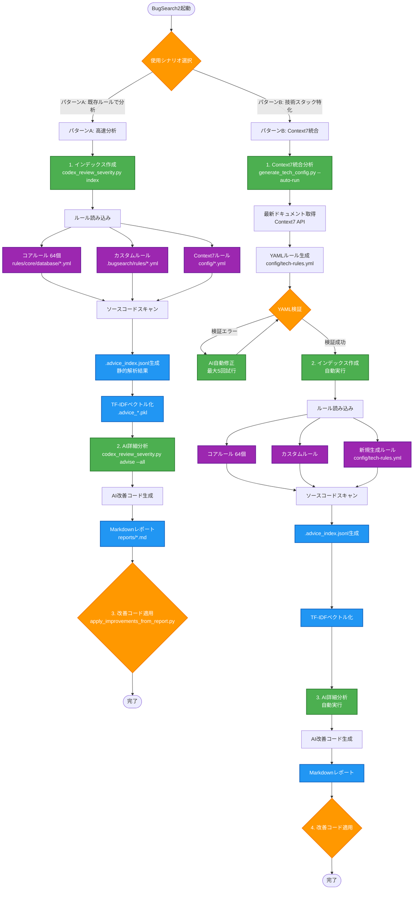
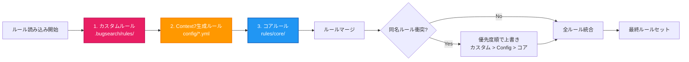
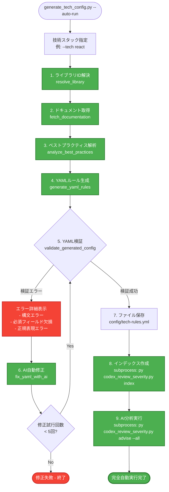
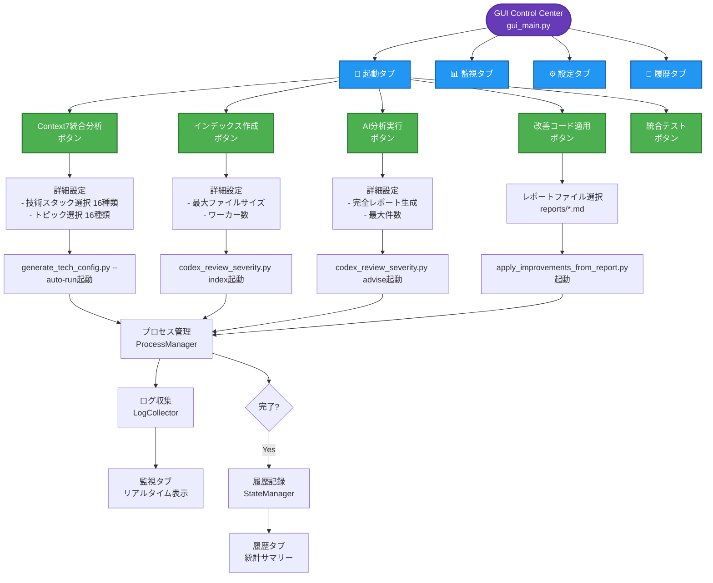
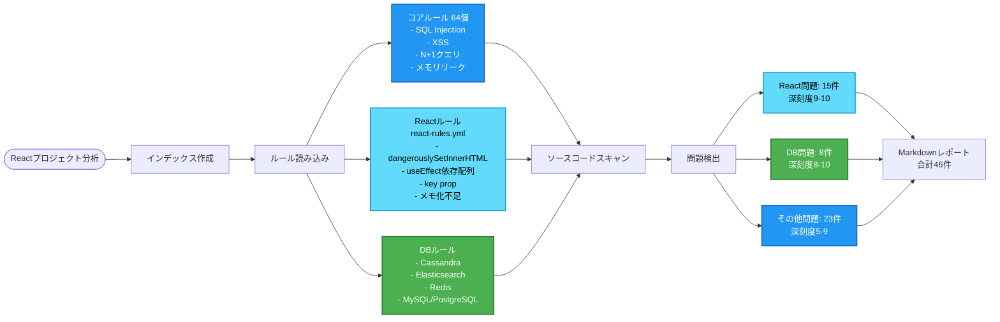
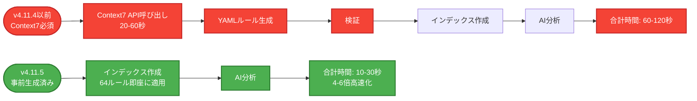

# BugSearch2 全体処理フロー図

## 完全な処理フローチャート



## ルール優先順位システム



## Context7統合分析の詳細フロー（Phase 8.2完全自動）



## GUI Control Centerとの統合フロー



## 技術スタック別ルール適用例（React分析）



## v4.11.5の事前生成ルールによる高速化



## まとめ: 推奨ワークフロー

### ケース1: 初回分析（コアルールで十分）
```bash
# 1. インデックス作成（64コアルール + カスタムルール適用）
py codex_review_severity.py index

# 2. AI詳細分析
py codex_review_severity.py advise --all --out reports/initial_analysis

# 3. 改善コード適用
python apply_improvements_from_report.py reports/initial_analysis.md --apply
```

### ケース2: 技術スタック特化分析（React/Angular等）
```bash
# 完全自動実行（Context7 → インデックス → AI分析）
python generate_tech_config.py --tech react --auto-run
```

### ケース3: GUI経由（推奨）
```bash
# GUIを起動
python gui_main.py

# GUIで以下を実行:
# 1. 起動タブ → Context7統合分析（オプション）
# 2. 起動タブ → インデックス作成
# 3. 起動タブ → AI分析実行
# 4. 起動タブ → 改善コード適用
# 5. 監視タブ → 進捗確認
# 6. 履歴タブ → 結果確認
```

---

**v4.11.5の主な変更点:**
- ✅ **64ルールを事前生成** → Context7不要で即座に分析可能
- ✅ **8データベース完全対応** → Cassandra, Elasticsearch, Redis等の深層分析
- ✅ **GUI統合** → 16技術スタックから選択可能

**最終更新:** 2025年10月14日 04:00 JST
**バージョン:** v4.11.5
